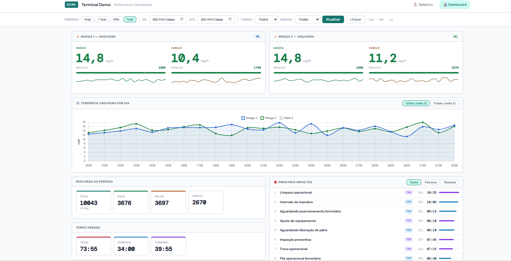
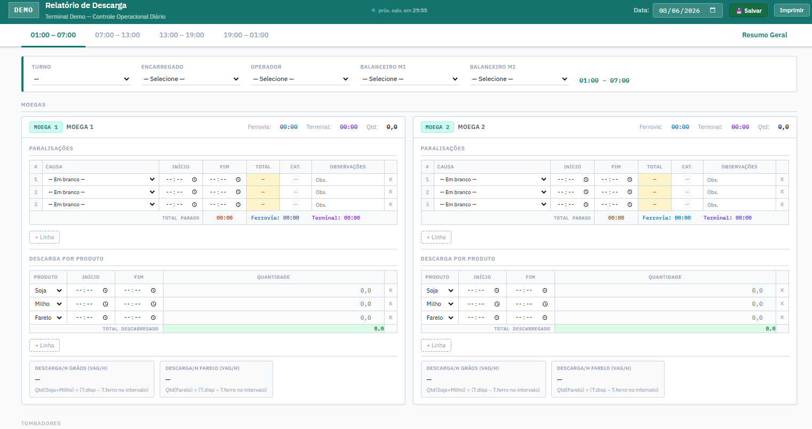

# Sistema de Descarga Operacional — Dashboard de Performance



## 📋 Sobre o Projeto

Sistema web desenvolvido em **Python + Flask** para acompanhamento operacional de descargas, gestão de turnos, controle de paradas e monitoramento de indicadores de desempenho em tempo real.

A aplicação centraliza informações operacionais em um único painel, permitindo análise rápida de produtividade, identificação de gargalos e suporte à tomada de decisão.

---

## 🚀 Resultados Obtidos

Durante a evolução da solução, foi possível reduzir significativamente o tempo de disponibilização das informações operacionais.

| Indicador                          | Antes    | Depois     |
| ---------------------------------- | -------- | ---------- |
| Atualização dos resultados diários | 3 horas  | Tempo real |
| Atualização dos resultados mensais | 24 horas | Tempo real |

### Benefícios

* Monitoramento operacional em tempo real.
* Redução do tempo de consolidação dos indicadores.
* Maior agilidade na tomada de decisão.
* Visibilidade contínua dos resultados.
* Identificação rápida de desvios operacionais.
* Melhoria do acompanhamento de produtividade.

---

## 🖥️ Dashboard

O painel apresenta indicadores operacionais consolidados e atualizados em tempo real.

### Principais indicadores

* Vagões por hora (Vag/H)
* Produtividade por equipamento
* Descarga por produto
* Tendência diária de desempenho
* Tempo parado
* Principais impactos operacionais
* Indicadores ferroviários e terminais


---

## 📝 Relatório Operacional

Tela utilizada para lançamento das informações de turno, descargas e paradas operacionais.



---

## ⚙️ Funcionalidades

### Gestão Operacional

* Registro de turnos.
* Cadastro de descargas.
* Controle de paradas operacionais.
* Classificação de ocorrências.
* Histórico operacional.

### Dashboard Executivo

* KPIs operacionais.
* Tendência diária.
* Indicadores de produtividade.
* Comparativo por equipamento.
* Análise de impactos.
* Consolidação automática dos resultados.

### Persistência de Dados

* Armazenamento em Excel.
* Backup automático.
* Importação de histórico.
* Estrutura preparada para migração futura para banco de dados.

---

## 🛠️ Tecnologias Utilizadas

### Backend

* Python
* Flask
* OpenPyXL

### Frontend

* HTML5
* CSS3
* JavaScript

### Armazenamento

* Microsoft Excel (.xlsx)

### Deploy

* Render

---

## 📁 Estrutura do Projeto

```text
.
├── server.py
├── requirements.txt
├── data/
│   └── relatorios.xlsx
├── scripts/
│   └── importar_historico.py
├── static/
│   ├── dashboard.html
│   ├── relatorio.html
│   ├── css/
│   └── js/
└── docs/
    ├── dashboard.png
    └── relatorio.png
```

---

## ▶️ Como Executar Localmente

### Criar ambiente virtual

```bash
python -m venv .venv
```

### Ativar ambiente

Windows:

```bash
.venv\Scripts\activate
```

Linux/macOS:

```bash
source .venv/bin/activate
```

### Instalar dependências

```bash
pip install -r requirements.txt
```

### Executar aplicação

```bash
python server.py
```

---

## 🌐 Acesso

Após iniciar o servidor:

**Dashboard**

```text
http://localhost:5050
```

**Relatório Operacional**

```text
http://localhost:5050/relatorio
```

---

## 📊 Base de Dados

O sistema utiliza por padrão:

```text
data/relatorios.xlsx
```

Também é possível definir uma pasta externa utilizando a variável de ambiente:

```bash
APP_DATA=/caminho/dos/dados
```

---

## ☁️ Deploy

A aplicação pode ser publicada facilmente em plataformas como:

* Render
* Railway
* PythonAnywhere
* VPS Linux

Deploy de demonstração:

```text
https://dashboard-de-performance-operacional.onrender.com
```

---

## 🔒 Privacidade

Todos os dados disponibilizados neste repositório são fictícios e foram anonimizados para fins de demonstração pública.

Nenhuma informação operacional real, nome de empresa ou dado pessoal é distribuído neste projeto.

---

## 👨‍💻 Autor

Rubens Costa

Desenvolvedor de soluções de automação, dados e sistemas operacionais voltados para aumento de produtividade e tomada de decisão baseada em indicadores.
